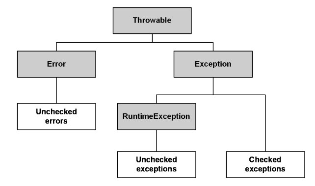

# 예외처리 

코틀린의 모든 예외 클래스는 최상위 예외 클래스인 **Throwable**을 상속한다.



- **Error** : **시스템에 비정상적인 상황이 발생**했다는 뜻. 예측이 어렵고 기본적으로 복구가 불가능 함
  - e.x. OutOfMemoryError, StackOverFlowError
- **Exception** : **시스템에서 포착 가능**하여(try-catch) 복구 가능. 예외 처리 강제 
  - e.x. IOException, FileNotFoundException, etc
  - **@Transactional** 에서 해당 예외가 발생하면 **기본적으론 롤백이 동작하지 않음**
    - **rollbackFor** 를 사용해야함!
  - **RuntimeException** : **런타임 시에 발생하는 예외**. 예외 처리를 강제하지 않음
    - e.x. NullPointException, ArrayIndexOutOfBoundsException, etc

    
#### 자바에서의 예외처리
- 자바에서 Checked Exception은 컴파일 에러가 발생하기 때문에 **무조건 try-catch로 감싸주거나 throws로 예외를 전파**해야함

```java
try {
  Thread.sleep(1);
    } catch (InterruptedException e) {
  //예외 처리
    }
```

#### 코틀린에서의 예외처리
- 코틀린은 **Checked Exception**을 강제하지 않는다
- 코틀린에서는 try-catch를 안 감싸도 컴파일 오류가 발생하지 않는다

```kotlin
Thread.sleep(1)
```


